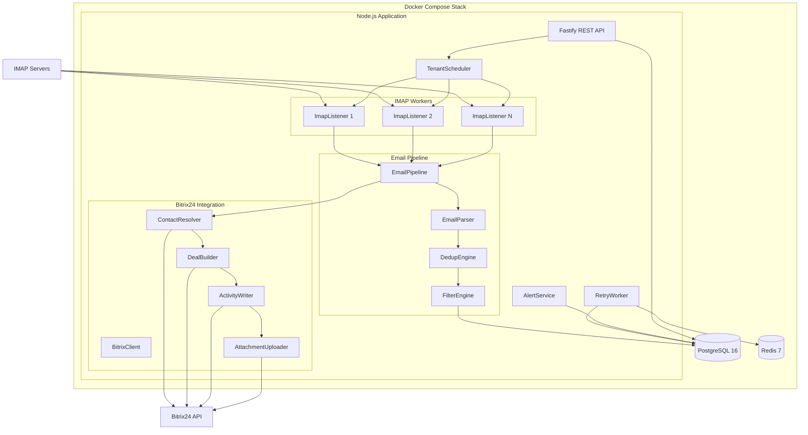
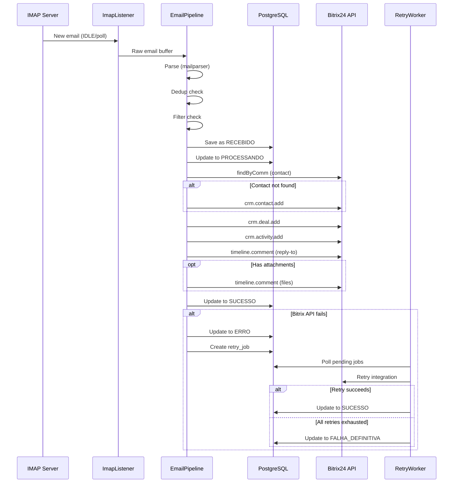
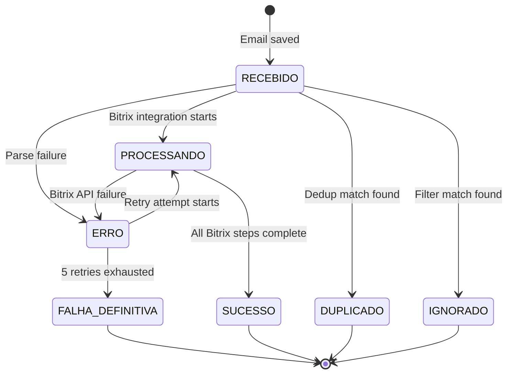

# Design Document: Email-Bitrix App

## Overview

The Email-Bitrix App is a multi-tenant Node.js application that bridges IMAP email accounts with Bitrix24 CRM. It monitors mailboxes in real-time (via IMAP IDLE or polling), processes incoming emails through a pipeline (parse → dedup → filter → persist → Bitrix24 integration), and automatically creates deals, contacts, activities, and timeline entries in Bitrix24.

The system replaces a fragile n8n workflow by providing:
- Full traceability of every email received
- Configurable retry with exponential backoff
- Multi-tenant isolation (1 tenant = 1 Bitrix24 URL, N IMAP accounts)
- SLA-based alerting for stuck emails
- REST API for management and monitoring

### Key Design Decisions

| Decision | Choice | Rationale |
|----------|--------|-----------|
| Runtime | Node.js 20+ (ES modules) | Async I/O ideal for IMAP connections and HTTP calls |
| Database | PostgreSQL 16 | JSONB for flexible API logs, partial indexes for dedup queries |
| IMAP library | imapflow | Mature, supports IDLE, good reconnection primitives |
| Email parsing | mailparser | Battle-tested RFC 2822 parser |
| HTTP framework | Fastify | High performance, schema validation, plugin ecosystem |
| Queue/Retry | BullMQ + Redis 7 | Reliable delayed jobs with exponential backoff |
| Encryption | AES-256-GCM (Node crypto) | Authenticated encryption, no external dependencies |
| Auth | JWT + bcrypt | Stateless auth, industry-standard password hashing |
| Logging | pino | Structured JSON logging, low overhead |
| Deployment | Docker Compose | Single-command deployment for app + Postgres + Redis |

## Architecture



### Data Flow



### Concurrency Model

- **One ImapListener per IMAP account**: Each account runs in its own async context, managed by TenantScheduler via an in-memory Map.
- **Synchronous pipeline per email**: Within a single ImapListener, emails are processed sequentially (parse → dedup → filter → save → Bitrix). This avoids race conditions in dedup and simplifies error handling.
- **RetryWorker**: Single instance polling every 30s. Uses `SELECT ... FOR UPDATE SKIP LOCKED` to prevent duplicate processing if multiple instances run.
- **AlertService**: Single instance polling every 60s (configurable). Stateless checks against DB timestamps.

## Components and Interfaces

### CryptoModule (`src/crypto/passwords.js`)

```javascript
/**
 * Encrypts a plaintext password using AES-256-GCM.
 * @param {string} plaintext - Password to encrypt (1-512 chars)
 * @param {Buffer} key - 32-byte encryption key from ENCRYPTION_KEY env var
 * @returns {string} Base64-encoded string containing: IV (12 bytes) + authTag (16 bytes) + ciphertext
 */
export function encrypt(plaintext, key) {}

/**
 * Decrypts a previously encrypted password.
 * @param {string} encrypted - Base64-encoded string from encrypt()
 * @param {Buffer} key - Same 32-byte key used for encryption
 * @returns {string} Original plaintext password
 * @throws {Error} If decryption fails (invalid key, corrupted data, tag mismatch)
 */
export function decrypt(encrypted, key) {}

/**
 * Validates the ENCRYPTION_KEY environment variable.
 * @returns {Buffer} 32-byte key buffer
 * @throws {Error} If key is missing or not 32 bytes
 */
export function loadEncryptionKey() {}
```

### EmailParser (`src/imap/EmailParser.js`)

```javascript
/**
 * Parses a raw email buffer into a structured EmailEvent object.
 * @param {Buffer} rawEmail - Raw email bytes from IMAP
 * @returns {Promise<EmailEventData>} Parsed email fields
 * @throws {Error} If message_id or from_email is missing
 */
export async function parseRaw(rawEmail) {}

/**
 * @typedef {Object} EmailEventData
 * @property {string} message_id
 * @property {string} from_email
 * @property {string|null} from_name
 * @property {string|null} reply_to
 * @property {string} subject
 * @property {string|null} body_html - Truncated to 200KB
 * @property {string|null} body_text - Truncated to 10KB
 * @property {string[]} to_emails
 * @property {string[]} cc_emails
 * @property {number} attachment_count
 * @property {Array<AttachmentData>} attachments
 */
```

### DedupEngine (`src/pipeline/DedupEngine.js`)

```javascript
/**
 * Checks if an email is a duplicate.
 * @param {EmailEventData} email - Parsed email data
 * @param {string} imapAccountId - UUID of the IMAP account
 * @returns {Promise<{isDuplicate: boolean, reason: string|null}>}
 */
export async function checkDuplicate(email, imapAccountId) {}
```

### FilterEngine (`src/pipeline/FilterEngine.js`)

```javascript
/**
 * Checks if an email should be ignored based on tenant rules.
 * @param {EmailEventData} email - Parsed email data
 * @param {TenantConfig} tenant - Tenant configuration with ignore_from and ignore_subject
 * @returns {{isIgnored: boolean, reason: string|null}}
 */
export function checkFilter(email, tenant) {}
```

### EmailPipeline (`src/pipeline/EmailPipeline.js`)

```javascript
/**
 * Orchestrates the full email processing pipeline.
 * @param {Buffer} rawEmail - Raw email from IMAP
 * @param {string} imapAccountId - UUID of the IMAP account
 * @param {string} tenantId - UUID of the tenant
 * @returns {Promise<{eventId: string, status: string}>}
 */
export async function processEmail(rawEmail, imapAccountId, tenantId) {}
```

### ImapListener (`src/imap/ImapListener.js`)

```javascript
export class ImapListener {
  /**
   * @param {ImapAccountConfig} config - Decrypted IMAP account configuration
   * @param {Function} onEmail - Callback invoked with raw email buffer
   */
  constructor(config, onEmail) {}

  /** Starts IDLE or polling based on config.poll_mode */
  async start() {}

  /** Gracefully stops the listener */
  async stop() {}

  /** Pauses monitoring without disconnecting */
  async pause() {}

  /** Resumes monitoring after pause */
  async resume() {}
}
```

### TenantScheduler (`src/imap/TenantScheduler.js`)

```javascript
export class TenantScheduler {
  /** @type {Map<string, ImapListener>} accountId -> listener */
  #workers = new Map();

  /** Loads all active accounts and starts listeners */
  async startAll() {}

  /** Starts a single IMAP worker */
  async addWorker(imapAccountId) {}

  /** Stops and removes a single IMAP worker */
  async removeWorker(imapAccountId) {}

  /** Pauses a worker (toggle off) */
  async pauseWorker(imapAccountId) {}

  /** Resumes a worker (toggle on) */
  async resumeWorker(imapAccountId) {}

  /** Stops all workers for a tenant */
  async stopTenant(tenantId) {}

  /** Returns status of all workers */
  getStatus() {}
}
```

### BitrixClient (`src/bitrix/BitrixClient.js`)

```javascript
export class BitrixClient {
  /**
   * @param {string} baseUrl - Bitrix24 webhook URL
   * @param {string} token - Webhook token
   */
  constructor(baseUrl, token) {}

  /**
   * Makes an API call with internal retry (3 attempts, 2s delay).
   * @param {string} method - Bitrix24 REST method (e.g., 'crm.deal.add')
   * @param {Object} params - Method parameters
   * @returns {Promise<Object>} API response
   * @throws {BitrixError} After 3 failed attempts or on non-transient error
   */
  async call(method, params) {}
}
```

### ContactResolver (`src/bitrix/ContactResolver.js`)

```javascript
/**
 * Finds or creates a Bitrix24 contact by email.
 * @param {BitrixClient} client
 * @param {string} email - Sender email
 * @param {string} name - Sender name (falls back to email local part)
 * @returns {Promise<{contactId: number, wasCreated: boolean}>}
 */
export async function resolveContact(client, email, name) {}
```

### DealBuilder (`src/bitrix/DealBuilder.js`)

```javascript
/**
 * Creates a deal in Bitrix24.
 * @param {BitrixClient} client
 * @param {Object} params
 * @param {number} params.contactId
 * @param {string} params.subject - Email subject (truncated to 300 chars)
 * @param {number} params.categoryId
 * @param {string} params.stageId
 * @param {number} params.responsibleId
 * @returns {Promise<{dealId: number}>}
 */
export async function createDeal(client, params) {}
```

### ActivityWriter (`src/bitrix/ActivityWriter.js`)

```javascript
/**
 * Creates an email activity and timeline comment.
 * @param {BitrixClient} client
 * @param {Object} params
 * @param {number} params.dealId
 * @param {string} params.subject
 * @param {string} params.bodyHtml
 * @param {string} params.replyTo - Falls back to fromEmail
 * @param {number} params.responsibleId
 * @returns {Promise<{activityId: number}>}
 */
export async function createActivity(client, params) {}
```

### AttachmentUploader (`src/bitrix/AttachmentUploader.js`)

```javascript
/**
 * Uploads attachments as timeline comments.
 * @param {BitrixClient} client
 * @param {number} dealId
 * @param {Array<AttachmentData>} attachments
 * @returns {Promise<{uploaded: number, skipped: number, failed: number}>}
 */
export async function uploadAttachments(client, dealId, attachments) {}
```

### RetryWorker (`src/jobs/RetryWorker.js`)

```javascript
export class RetryWorker {
  /** Starts polling every 30 seconds */
  async start() {}

  /** Stops the polling loop */
  async stop() {}

  /** Processes a single retry job */
  async executeJob(job) {}
}
```

### AlertService (`src/alerts/AlertService.js`)

```javascript
export class AlertService {
  /**
   * @param {number} checkIntervalSec - Polling interval (default 60)
   */
  constructor(checkIntervalSec) {}

  /** Starts periodic SLA checks */
  async start() {}

  /** Stops the service */
  async stop() {}

  /** Checks for stuck emails and sends alerts */
  async checkSLA() {}
}
```

### REST API Routes

| Method | Path | Auth | Description |
|--------|------|------|-------------|
| POST | /auth/login | None | Authenticate, return JWT |
| GET | /tenants | admin | List active tenants |
| POST | /tenants | admin | Create tenant |
| PATCH | /tenants/:id | admin | Update tenant |
| GET | /tenants/:id/imap-accounts | admin, owner | List IMAP accounts |
| POST | /tenants/:id/imap-accounts | admin, owner | Add IMAP account |
| PATCH | /tenants/:id/imap-accounts/:accountId/toggle | admin, owner | Pause/resume |
| DELETE | /tenants/:id/imap-accounts/:accountId | admin, owner | Deactivate |
| POST | /tenants/test-bitrix | admin, owner | Test Bitrix webhook |
| POST | /tenants/test-imap | admin, owner | Test IMAP connection |
| GET | /tenants/:id/events | admin, owner, viewer | Paginated event log |
| GET | /tenants/:id/dashboard | admin, owner, viewer | Daily stats (30 days) |
| GET | /admin/workers | admin | IMAP worker status |

## Data Models

### Database Schema

```sql
-- 001_tenants.sql
CREATE TABLE tenants (
    id UUID PRIMARY KEY DEFAULT gen_random_uuid(),
    name TEXT NOT NULL,
    bitrix_url TEXT NOT NULL UNIQUE,
    bitrix_webhook_token TEXT NOT NULL,
    bitrix_responsible_id INTEGER NOT NULL,
    bitrix_category_id INTEGER NOT NULL DEFAULT 9,
    bitrix_stage_id TEXT NOT NULL DEFAULT 'C9:NEW',
    ignore_from TEXT[] DEFAULT '{}',
    ignore_subject TEXT[] DEFAULT '{}',
    plan TEXT DEFAULT 'basic',
    active BOOLEAN NOT NULL DEFAULT true,
    created_at TIMESTAMPTZ NOT NULL DEFAULT now()
);

-- 002_imap_accounts.sql
CREATE TABLE imap_accounts (
    id UUID PRIMARY KEY DEFAULT gen_random_uuid(),
    tenant_id UUID NOT NULL REFERENCES tenants(id),
    label TEXT,
    email TEXT NOT NULL,
    host TEXT NOT NULL,
    port INTEGER NOT NULL DEFAULT 993,
    username TEXT NOT NULL,
    password_enc TEXT NOT NULL,
    use_ssl BOOLEAN NOT NULL DEFAULT true,
    mailbox TEXT NOT NULL DEFAULT 'INBOX',
    poll_mode TEXT NOT NULL DEFAULT 'idle' CHECK (poll_mode IN ('idle', 'poll')),
    poll_interval_sec INTEGER NOT NULL DEFAULT 60 CHECK (poll_interval_sec BETWEEN 30 AND 3600),
    active BOOLEAN NOT NULL DEFAULT true,
    last_poll_at TIMESTAMPTZ,
    last_error TEXT,
    created_at TIMESTAMPTZ NOT NULL DEFAULT now(),
    UNIQUE(tenant_id, email)
);

-- 003_email_events.sql
CREATE TABLE email_events (
    id UUID PRIMARY KEY DEFAULT gen_random_uuid(),
    tenant_id UUID NOT NULL REFERENCES tenants(id),
    imap_account_id UUID NOT NULL REFERENCES imap_accounts(id),
    message_id TEXT,
    from_email TEXT NOT NULL,
    from_name TEXT,
    reply_to TEXT,
    subject TEXT,
    body_html TEXT,
    body_text TEXT,
    to_emails JSONB DEFAULT '[]',
    cc_emails JSONB DEFAULT '[]',
    attachment_count INTEGER NOT NULL DEFAULT 0,
    status TEXT NOT NULL DEFAULT 'RECEBIDO' CHECK (status IN (
        'RECEBIDO', 'PROCESSANDO', 'SUCESSO', 'DUPLICADO', 'IGNORADO', 'ERRO', 'FALHA_DEFINITIVA'
    )),
    retry_count INTEGER NOT NULL DEFAULT 0,
    received_at TIMESTAMPTZ NOT NULL DEFAULT now(),
    processed_at TIMESTAMPTZ,
    created_at TIMESTAMPTZ NOT NULL DEFAULT now()
);

-- Partial index for dedup by message_id (24h window)
CREATE INDEX idx_email_events_dedup_msgid 
    ON email_events (imap_account_id, message_id, created_at)
    WHERE message_id IS NOT NULL;

-- Partial index for dedup by subject+from (2min window)
CREATE INDEX idx_email_events_dedup_subject_from 
    ON email_events (imap_account_id, lower(from_email), lower(subject), created_at);

-- Index for SLA checks
CREATE INDEX idx_email_events_status_received 
    ON email_events (tenant_id, status, received_at)
    WHERE status IN ('ERRO', 'PROCESSANDO');

-- 004_bitrix_results.sql
CREATE TABLE bitrix_results (
    id UUID PRIMARY KEY DEFAULT gen_random_uuid(),
    email_event_id UUID NOT NULL UNIQUE REFERENCES email_events(id),
    tenant_id UUID NOT NULL REFERENCES tenants(id),
    bitrix_contact_id INTEGER,
    contact_was_created BOOLEAN,
    bitrix_deal_id INTEGER,
    bitrix_activity_id INTEGER,
    api_log JSONB DEFAULT '[]',
    created_at TIMESTAMPTZ NOT NULL DEFAULT now()
);

-- 005_retry_jobs.sql
CREATE TABLE retry_jobs (
    id UUID PRIMARY KEY DEFAULT gen_random_uuid(),
    email_event_id UUID NOT NULL REFERENCES email_events(id),
    attempt_number INTEGER NOT NULL CHECK (attempt_number BETWEEN 1 AND 5),
    error_message TEXT,
    error_stack TEXT,
    scheduled_at TIMESTAMPTZ NOT NULL,
    executed_at TIMESTAMPTZ,
    success BOOLEAN,
    created_at TIMESTAMPTZ NOT NULL DEFAULT now()
);

-- Index for RetryWorker polling
CREATE INDEX idx_retry_jobs_pending 
    ON retry_jobs (scheduled_at)
    WHERE success IS NULL;

-- 006_alert_configs.sql
CREATE TABLE alert_configs (
    id UUID PRIMARY KEY DEFAULT gen_random_uuid(),
    tenant_id UUID NOT NULL REFERENCES tenants(id),
    alert_type TEXT NOT NULL CHECK (alert_type IN ('EMAIL', 'WEBHOOK', 'SLACK')),
    destination TEXT NOT NULL,
    sla_minutes INTEGER NOT NULL DEFAULT 15,
    active BOOLEAN NOT NULL DEFAULT true,
    created_at TIMESTAMPTZ NOT NULL DEFAULT now()
);

-- 007_users.sql
CREATE TABLE users (
    id UUID PRIMARY KEY DEFAULT gen_random_uuid(),
    email TEXT NOT NULL UNIQUE,
    password_hash TEXT NOT NULL,
    role TEXT NOT NULL DEFAULT 'tenant_user' CHECK (role IN ('admin', 'tenant_user')),
    created_at TIMESTAMPTZ NOT NULL DEFAULT now()
);

CREATE TABLE user_tenants (
    user_id UUID NOT NULL REFERENCES users(id),
    tenant_id UUID NOT NULL REFERENCES tenants(id),
    role TEXT NOT NULL DEFAULT 'viewer' CHECK (role IN ('owner', 'viewer')),
    PRIMARY KEY (user_id, tenant_id)
);
```

### Key Data Constraints

| Constraint | Implementation |
|-----------|---------------|
| body_html max 200KB | Application-level truncation in EmailParser |
| body_text max 10KB | Application-level truncation in EmailParser |
| Max 50 IMAP accounts per tenant | Application-level check in API route |
| Attachment max 20MB | Application-level check in AttachmentUploader |
| Deal title max 300 chars | Application-level truncation in DealBuilder |
| Password 1-512 chars | Application-level validation in CryptoModule |

### Environment Variables

| Variable | Required | Default | Description |
|----------|----------|---------|-------------|
| PORT | No | 3000 | HTTP server port |
| DATABASE_URL | Yes | - | PostgreSQL connection string |
| REDIS_URL | Yes | - | Redis connection string |
| ENCRYPTION_KEY | Yes | - | 32-byte hex-encoded AES key |
| JWT_SECRET | Yes | - | JWT signing secret |
| JWT_EXPIRES_IN | No | 8h | JWT token expiration |
| ALERT_CHECK_INTERVAL_SEC | No | 60 | Alert polling interval |
| LOG_LEVEL | No | info | pino log level |

## Correctness Properties

*A property is a characteristic or behavior that should hold true across all valid executions of a system — essentially, a formal statement about what the system should do. Properties serve as the bridge between human-readable specifications and machine-verifiable correctness guarantees.*

### Property 1: Encryption round-trip

*For any* plaintext password between 1 and 512 characters, encrypting it with a valid 256-bit key and then decrypting the result with the same key SHALL produce the original plaintext password.

**Validates: Requirements 19.3**

### Property 2: Unique initialization vector per encryption

*For any* plaintext password, encrypting it twice with the same key SHALL produce two different ciphertext outputs (due to unique random 12-byte IV generation per operation).

**Validates: Requirements 19.1**

### Property 3: Email parsing round-trip

*For any* valid EmailEventData object (containing at minimum message_id and from_email), serializing it to raw email format and then parsing it back SHALL produce a field-by-field equivalent EmailEventData object.

**Validates: Requirements 4.5**

### Property 4: Valid email parsing completeness

*For any* raw email containing at minimum a message_id and from_email field, parsing SHALL produce an EmailEventData object with all required fields populated (message_id, from_email, subject, to_emails, cc_emails, attachment_count) and optional fields set to null or empty arrays when absent.

**Validates: Requirements 4.1, 4.2, 4.4**

### Property 5: Invalid email rejection

*For any* raw email that is missing a message_id field or missing a from_email field, the parser SHALL reject it with an error status, and SHALL not produce a valid EmailEventData object.

**Validates: Requirements 4.3, 4.4**

### Property 6: Message-ID deduplication within 24-hour window

*For any* email with a non-empty message_id, if another email_event with the same message_id exists for the same imap_account_id and was created within the last 24 hours, the DedupEngine SHALL classify it as duplicate.

**Validates: Requirements 5.1**

### Property 7: Subject+from deduplication within 2-minute window

*For any* email, if another email_event with the same from_email (case-insensitive) and same subject (case-insensitive, trimmed) exists for the same imap_account_id and was created within the last 2 minutes, the DedupEngine SHALL classify it as duplicate.

**Validates: Requirements 5.2**

### Property 8: Filter by sender address

*For any* email and any tenant ignore_from list, if the email's from_email matches any entry in the list using case-insensitive exact comparison, the FilterEngine SHALL classify it as ignored. If no entry matches, the email SHALL pass through.

**Validates: Requirements 6.1**

### Property 9: Filter by subject pattern

*For any* email and any tenant ignore_subject list, if the email's subject contains any entry in the list using case-insensitive substring comparison, the FilterEngine SHALL classify it as ignored. If no entry matches as a substring, the email SHALL pass through.

**Validates: Requirements 6.2**

### Property 10: Contact name fallback to email local part

*For any* email address, when the sender's from_name is null or empty, the ContactResolver SHALL use the local part (everything before the '@' character) of the from_email as the contact name.

**Validates: Requirements 8.4**

### Property 11: Deal title truncation

*For any* email subject string, the deal title SHALL be at most 300 characters long and SHALL be a prefix of the original subject. If the subject is empty or null, the deal title SHALL be the sender's email address.

**Validates: Requirements 9.3, 9.4**

### Property 12: Attachment size threshold

*For any* attachment, if its size exceeds 20MB the AttachmentUploader SHALL skip it without error. If its size is 20MB or less, the AttachmentUploader SHALL attempt to upload it.

**Validates: Requirements 11.4**

### Property 13: Retry backoff delay sequence

*For any* attempt number N (where 1 ≤ N ≤ 5), the scheduled retry delay SHALL be exactly the Nth value in the sequence [2, 5, 15, 30, 60] minutes.

**Validates: Requirements 13.2**

### Property 14: HTTP error transient classification

*For any* HTTP response status code, the BitrixClient SHALL classify it as transient (eligible for retry) if and only if it is 429 or in the 5xx range or is a connection/socket timeout. All other error codes (400, 401, 403, 404) SHALL be classified as non-transient and propagated immediately without retry.

**Validates: Requirements 14.1, 14.4**

## Error Handling

### Error Classification

| Error Type | Source | Handling Strategy |
|-----------|--------|-------------------|
| Parse error | EmailParser | Mark ERRO, log, skip email |
| Dedup match | DedupEngine | Mark DUPLICADO, persist, stop pipeline |
| Filter match | FilterEngine | Mark IGNORADO, persist, stop pipeline |
| DB write failure | PostgreSQL | Do not proceed to Bitrix, log for recovery |
| Bitrix transient (429, 5xx, timeout) | BitrixClient | Internal retry 3x with 2s delay |
| Bitrix non-transient (4xx) | BitrixClient | Immediate propagation, mark ERRO |
| Pipeline Bitrix failure | EmailPipeline | Mark ERRO, schedule retry_job |
| Retry exhaustion (5 attempts) | RetryWorker | Mark FALHA_DEFINITIVA, trigger alert |
| IMAP connection drop | ImapListener | Exponential backoff reconnect (5s base, 5 attempts) |
| IMAP exhausted retries | ImapListener | Mark account error, stop until next cycle |
| Encryption key missing | CryptoModule | Refuse to start, exit with error |
| Decryption failure | CryptoModule | Return error without exposing secrets |
| Auth failure | REST API | 401 response, no token issued |
| Authorization failure | REST API | 403 response, no data exposed |

### Status State Machine



### Graceful Degradation

- **Individual IMAP worker failure**: Other workers continue unaffected. Failed worker logs error and attempts reconnection.
- **Bitrix24 API unavailable**: Emails are saved as RECEBIDO/ERRO. RetryWorker will process them when API recovers.
- **Database unavailable**: Application exits (startup) or logs critical error (runtime). No data loss since emails remain on IMAP server.
- **Redis unavailable**: Application exits at startup. BullMQ jobs are persisted in Redis, so recovery after restart is automatic.
- **Single attachment failure**: Other attachments continue uploading. Pipeline completes with partial success.

## Testing Strategy

### Unit Tests (vitest)

Focus on pure logic modules with example-based tests:

| Module | Test Focus |
|--------|-----------|
| CryptoModule | Key validation, error cases (invalid key, corrupted data) |
| EmailParser | Specific email formats, edge cases (missing fields, large bodies) |
| DedupEngine | Boundary conditions (exactly 24h, exactly 2min) |
| FilterEngine | Empty lists, exact match vs substring |
| DealBuilder | Empty subject fallback, exact 300-char boundary |
| BitrixClient | Specific HTTP status handling, timeout behavior |
| ContactResolver | Multiple contacts, no contacts, empty name |
| AttachmentUploader | No attachments, partial failure, exact 20MB boundary |
| RetryWorker | Job scheduling, attempt counting |

### Property-Based Tests (fast-check)

Each correctness property is implemented as a property-based test using [fast-check](https://github.com/dubzzz/fast-check) with minimum 100 iterations per property.

| Property | Module Under Test | Generator Strategy |
|----------|-------------------|-------------------|
| 1: Encryption round-trip | CryptoModule | Random strings 1-512 chars (printable + unicode) |
| 2: Unique IV | CryptoModule | Same password encrypted twice |
| 3: Parsing round-trip | EmailParser | Random EmailEventData objects |
| 4: Parsing completeness | EmailParser | Random raw emails with required fields |
| 5: Invalid email rejection | EmailParser | Random raw emails missing message_id or from_email |
| 6: Message-ID dedup | DedupEngine | Random message_ids + timestamps within/outside 24h |
| 7: Subject+from dedup | DedupEngine | Random subjects/emails with case/whitespace variations |
| 8: Filter by sender | FilterEngine | Random emails + random ignore_from lists |
| 9: Filter by subject | FilterEngine | Random subjects + random ignore_subject lists |
| 10: Contact name fallback | ContactResolver | Random email addresses |
| 11: Deal title truncation | DealBuilder | Random strings 0-1000 chars |
| 12: Attachment size threshold | AttachmentUploader | Random sizes 0-50MB |
| 13: Retry backoff | RetryWorker | Attempt numbers 1-5 |
| 14: HTTP error classification | BitrixClient | Random HTTP status codes 100-599 |

**Configuration:**
- Library: `fast-check` (npm package)
- Minimum iterations: 100 per property
- Tag format: `Feature: email-bitrix-app, Property {N}: {title}`
- Test file location: `src/__tests__/properties/`

### Integration Tests

Focus on component interactions with real PostgreSQL (via testcontainers or docker) and mocked external services:

| Scope | Test Focus |
|-------|-----------|
| Full pipeline | Email → parse → dedup → filter → save → Bitrix (mocked) |
| Tenant isolation | Two tenants, verify no cross-contamination |
| API endpoints | CRUD operations, pagination, filtering |
| Auth flow | Login, JWT validation, role-based access |
| Worker lifecycle | Start, pause, resume, stop |
| Retry flow | Failure → retry_job → success/exhaustion |
| Alert flow | Stuck email → SLA check → notification |

### Test Infrastructure

```
src/
├── __tests__/
│   ├── properties/          # Property-based tests (fast-check)
│   │   ├── crypto.prop.test.js
│   │   ├── parser.prop.test.js
│   │   ├── dedup.prop.test.js
│   │   ├── filter.prop.test.js
│   │   ├── bitrix.prop.test.js
│   │   └── pipeline.prop.test.js
│   ├── unit/                # Example-based unit tests
│   │   ├── crypto.test.js
│   │   ├── parser.test.js
│   │   ├── dedup.test.js
│   │   ├── filter.test.js
│   │   └── ...
│   ├── integration/         # Integration tests
│   │   ├── pipeline.int.test.js
│   │   ├── api.int.test.js
│   │   └── ...
│   └── helpers/             # Test utilities, generators, mocks
│       ├── generators.js    # fast-check arbitraries
│       └── mocks.js         # Bitrix API mocks
```

