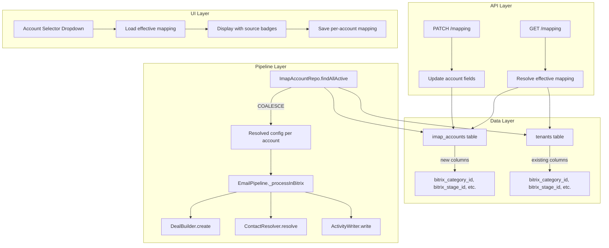

# Design Document: Per-Account Mapping

## Overview

Esta feature migra as configurações de mapeamento de funil (pipeline, estágio, responsável, field_mapping, deal_mode, sync_start_date) do nível do Tenant para o nível de cada conta IMAP individual. Isso permite que diferentes caixas de e-mail dentro do mesmo tenant roteiem e-mails para pipelines, estágios e responsáveis distintos no Bitrix24.

A abordagem utiliza **fallback progressivo**: cada conta IMAP pode ter suas próprias configurações (override) ou herdar do tenant (quando o campo é NULL). A resolução é feita campo a campo, permitindo configurações híbridas.

### Design Decisions

1. **COALESCE no SQL vs. resolução em código**: Optamos por COALESCE no SQL (nas queries do repositório) para que o pipeline já receba os valores resolvidos sem lógica adicional. Isso mantém o EmailPipeline inalterado em sua lógica de negócio.

2. **Herança na criação vs. NULL por padrão**: Novas contas copiam os valores atuais do tenant (Requirement 3), para que funcionem imediatamente sem configuração manual. Isso difere de começar com NULL (que também funcionaria via fallback) mas dá ao usuário uma base editável.

3. **Full replacement para field_mapping**: Quando a conta tem field_mapping não-NULL, ele substitui COMPLETAMENTE o do tenant (sem merge de chaves). Isso evita complexidade de deep merge e dá controle total ao administrador.

4. **Endpoint separado `/mapping`**: Criamos um endpoint dedicado (PATCH/GET) em vez de reutilizar o PATCH existente da conta, para separar concerns de conexão IMAP vs. configuração de roteamento.

## Architecture



## Components and Interfaces

### 1. Database Migration (013_add_account_mapping.sql)

Adiciona 6 colunas nullable à tabela `imap_accounts`:

```sql
ALTER TABLE imap_accounts ADD COLUMN IF NOT EXISTS bitrix_category_id INTEGER;
ALTER TABLE imap_accounts ADD COLUMN IF NOT EXISTS bitrix_stage_id TEXT;
ALTER TABLE imap_accounts ADD COLUMN IF NOT EXISTS bitrix_responsible_id INTEGER;
ALTER TABLE imap_accounts ADD COLUMN IF NOT EXISTS field_mapping JSONB;
ALTER TABLE imap_accounts ADD COLUMN IF NOT EXISTS deal_mode TEXT CHECK (deal_mode IS NULL OR deal_mode IN ('create_new', 'merge_by_contact'));
ALTER TABLE imap_accounts ADD COLUMN IF NOT EXISTS sync_start_date TIMESTAMPTZ;
```

### 2. ImapAccountRepo (Updated Queries)

**findAllActive()** — Atualizar para usar COALESCE entre `ia.*` e `t.*`:

```javascript
// Resolve: account value if non-NULL, else tenant value
`SELECT
   ia.*,
   t.bitrix_url,
   t.bitrix_webhook_token,
   t.ignore_from,
   t.ignore_subject,
   t.auth_id,
   t.refresh_id,
   COALESCE(ia.bitrix_category_id, t.bitrix_category_id) AS bitrix_category_id,
   COALESCE(ia.bitrix_stage_id, t.bitrix_stage_id) AS bitrix_stage_id,
   COALESCE(ia.bitrix_responsible_id, t.bitrix_responsible_id) AS bitrix_responsible_id,
   COALESCE(ia.field_mapping, t.field_mapping, '{}') AS field_mapping,
   COALESCE(ia.deal_mode, t.deal_mode) AS deal_mode,
   COALESCE(ia.sync_start_date, t.sync_start_date) AS sync_start_date
 FROM imap_accounts ia
 JOIN tenants t ON t.id = ia.tenant_id
 WHERE ia.active = true AND t.active = true`
```

**findById()** — Mesma lógica de COALESCE.

**updateMapping(id, data)** — Novo método que atualiza apenas os campos de mapping:

```javascript
export async function updateMapping(id, data) {
  const mappingFields = [
    'bitrix_category_id', 'bitrix_stage_id', 'bitrix_responsible_id',
    'field_mapping', 'deal_mode', 'sync_start_date'
  ];
  // ... build SET clause only for provided mapping fields
}
```

**findRawById(id)** — Novo método que retorna os valores brutos (sem COALESCE) para a API de leitura:

```javascript
export async function findRawById(id) {
  // Returns ia.* without COALESCE for the mapping columns
  // Plus raw tenant values for comparison
}
```

### 3. API Endpoints (imapAccounts.js)

**GET /tenants/:id/imap-accounts/:accountId/mapping**

```javascript
// Response format:
{
  "effective": {
    "bitrix_category_id": 9,
    "bitrix_stage_id": "C9:NEW",
    "bitrix_responsible_id": 1,
    "field_mapping": { "subject": "TITLE", "body": "COMMENTS" },
    "deal_mode": "create_new",
    "sync_start_date": "2024-01-01T00:00:00Z"
  },
  "sources": {
    "bitrix_category_id": "tenant",
    "bitrix_stage_id": "account",
    "bitrix_responsible_id": "tenant",
    "field_mapping": "account",
    "deal_mode": "tenant",
    "sync_start_date": "account"
  }
}
```

**PATCH /tenants/:id/imap-accounts/:accountId/mapping**

```javascript
// Request body (partial update):
{
  "bitrix_category_id": 12,
  "bitrix_stage_id": null,  // resets to tenant fallback
  "deal_mode": "merge_by_contact"
}
// Response: full updated account object (sans password)
```

### 4. Mapping Resolution Function

Função pura extraída para resolução de mapping (testável via property-based tests):

```javascript
/**
 * Resolve effective mapping from account + tenant values.
 * For each of the 6 mapping fields:
 *   - Use account value if non-NULL
 *   - Otherwise use tenant value
 *   - For field_mapping: default to {} if both NULL
 *
 * @param {Object} account - Raw account record (may have NULL mapping fields)
 * @param {Object} tenant - Tenant record
 * @returns {Object} Resolved mapping configuration
 */
export function resolveMapping(account, tenant) {
  return {
    bitrix_category_id: account.bitrix_category_id ?? tenant.bitrix_category_id ?? null,
    bitrix_stage_id: account.bitrix_stage_id ?? tenant.bitrix_stage_id ?? null,
    bitrix_responsible_id: account.bitrix_responsible_id ?? tenant.bitrix_responsible_id ?? null,
    field_mapping: account.field_mapping ?? tenant.field_mapping ?? {},
    deal_mode: account.deal_mode ?? tenant.deal_mode ?? 'create_new',
    sync_start_date: account.sync_start_date ?? tenant.sync_start_date ?? null,
  };
}
```

### 5. EmailPipeline (Minimal Changes)

O pipeline já recebe os valores resolvidos via COALESCE no SQL. A única mudança é adicionar uma validação de campos obrigatórios antes de prosseguir com a criação do deal:

```javascript
// Before calling _processInBitrix:
if (!account.bitrix_category_id || !account.bitrix_stage_id) {
  await EmailEventRepo.setStatus(event.id, 'ERRO');
  logger.error(`[Pipeline] Missing required mapping (category/stage) for account=${account.id}`);
  return;
}
```

### 6. Account Creation (Herança do Tenant)

Na criação de conta, copiar os valores atuais do tenant:

```javascript
// In POST /tenants/:id/imap-accounts handler:
const tenant = await TenantRepo.findById(tenantId);
const accountData = {
  ...request.body,
  bitrix_category_id: tenant.bitrix_category_id,
  bitrix_stage_id: tenant.bitrix_stage_id,
  bitrix_responsible_id: tenant.bitrix_responsible_id,
  field_mapping: tenant.field_mapping,
  deal_mode: tenant.deal_mode,
  sync_start_date: tenant.sync_start_date,
};
```

### 7. UI Changes (bitrixApp.js — Mapeamento de Funil page)

Componentes JavaScript no SPA:
- **Account Selector dropdown**: No topo da página de Mapeamento de Funil
- **Source badges**: "Padrão do tenant" badge em campos com source === "tenant"
- **Reset button**: "Restaurar padrão do tenant" ao lado de cada campo com override
- **Empty state**: Mensagem quando tenant não tem contas configuradas

## Data Models

### imap_accounts (Updated)

| Column | Type | Nullable | Default | Description |
|--------|------|----------|---------|-------------|
| id | UUID | NO | gen_random_uuid() | Primary key |
| tenant_id | UUID | NO | - | FK to tenants |
| label | TEXT | YES | NULL | Display name |
| email | TEXT | NO | - | Email address |
| host | TEXT | NO | - | IMAP host |
| port | INTEGER | NO | 993 | IMAP port |
| username | TEXT | NO | - | IMAP username |
| password_enc | TEXT | NO | - | Encrypted password |
| use_ssl | BOOLEAN | NO | true | Use SSL |
| mailbox | TEXT | NO | 'INBOX' | Mailbox name |
| poll_mode | TEXT | NO | 'idle' | idle/poll |
| poll_interval_sec | INTEGER | NO | 60 | Poll interval |
| active | BOOLEAN | NO | true | Active status |
| last_poll_at | TIMESTAMPTZ | YES | NULL | Last poll time |
| last_error | TEXT | YES | NULL | Last error |
| **bitrix_category_id** | **INTEGER** | **YES** | **NULL** | **Pipeline ID (override)** |
| **bitrix_stage_id** | **TEXT** | **YES** | **NULL** | **Stage ID (override)** |
| **bitrix_responsible_id** | **INTEGER** | **YES** | **NULL** | **Responsible user (override)** |
| **field_mapping** | **JSONB** | **YES** | **NULL** | **Field mapping (override)** |
| **deal_mode** | **TEXT** | **YES** | **NULL** | **Deal creation mode (override)** |
| **sync_start_date** | **TIMESTAMPTZ** | **YES** | **NULL** | **Sync start date (override)** |
| created_at | TIMESTAMPTZ | NO | now() | Creation timestamp |

### Effective Mapping Response

```typescript
interface EffectiveMapping {
  effective: {
    bitrix_category_id: number | null;
    bitrix_stage_id: string | null;
    bitrix_responsible_id: number | null;
    field_mapping: Record<string, string>;
    deal_mode: 'create_new' | 'merge_by_contact';
    sync_start_date: string | null;
  };
  sources: {
    bitrix_category_id: 'account' | 'tenant';
    bitrix_stage_id: 'account' | 'tenant';
    bitrix_responsible_id: 'account' | 'tenant';
    field_mapping: 'account' | 'tenant';
    deal_mode: 'account' | 'tenant';
    sync_start_date: 'account' | 'tenant';
  };
}
```

## Correctness Properties

*A property is a characteristic or behavior that should hold true across all valid executions of a system — essentially, a formal statement about what the system should do. Properties serve as the bridge between human-readable specifications and machine-verifiable correctness guarantees.*

### Property 1: Mapping Resolution — Account overrides Tenant per field

*For any* account object and tenant object with any combination of NULL and non-NULL values across the 6 mapping fields (bitrix_category_id, bitrix_stage_id, bitrix_responsible_id, field_mapping, deal_mode, sync_start_date), the resolved mapping SHALL equal the account value for each field that is non-NULL, and the tenant value for each field that is NULL on the account.

**Validates: Requirements 2.1, 2.2, 2.3, 7.1, 7.2, 9.1**

### Property 2: field_mapping is full replacement (no key-level merge)

*For any* two non-NULL field_mapping JSON objects (one from the account, one from the tenant), when the account's field_mapping is non-NULL, the resolved field_mapping SHALL be exactly equal to the account's field_mapping — with no keys merged from the tenant's field_mapping.

**Validates: Requirements 7.5**

### Property 3: Validation rejects invalid mapping values

*For any* deal_mode value that is not "create_new", "merge_by_contact", or null, and *for any* bitrix_category_id or bitrix_responsible_id that is not a positive integer or null, the PATCH /mapping endpoint SHALL return HTTP 400.

**Validates: Requirements 4.6**

## Error Handling

| Scenario | Behavior | HTTP Code |
|----------|----------|-----------|
| Account not found / wrong tenant | Return error message | 404 |
| Missing/invalid JWT | Return unauthorized | 401 |
| User lacks tenant access | Return forbidden | 403 |
| Invalid deal_mode value | Return validation error | 400 |
| Non-positive integer for IDs | Return validation error | 400 |
| field_mapping exceeds 4096 bytes | Return validation error | 400 |
| bitrix_stage_id exceeds 50 chars | Return validation error | 400 |
| Both account and tenant NULL for category/stage | Set event to ERRO, log error | - (pipeline internal) |
| Empty request body on PATCH | Return current record, no update | 200 |
| Database connection error | 500 with generic error | 500 |

## Testing Strategy

### Property-Based Tests (fast-check, vitest)

O projeto já utiliza `fast-check` e `vitest`. As properties serão implementadas em `src/__tests__/properties/`:

- **resolveMapping.prop.test.js** — Testa as Properties 1 e 2 com geração aleatória de configurações
- **mappingValidation.prop.test.js** — Testa a Property 3 com geração de valores inválidos

Configuração: mínimo 100 iterações por property test.
Tag format: `Feature: per-account-mapping, Property N: <description>`

### Unit Tests

- `resolveMapping.test.js` — Exemplos específicos: todos NULL, todos non-NULL, mix, edge cases (empty object for field_mapping)
- `mappingValidation.test.js` — Valores de borda: empty string, 0, negative numbers, extra long strings

### Integration Tests

- Testar fluxo completo: criação de conta → herança do tenant → override via PATCH → verificação no pipeline
- Testar endpoints GET/PATCH com DB real
- Testar que contas existentes sem configuração continuam funcionando (retrocompatibilidade)

### Manual/UI Tests

- Verificar dropdown de seleção de conta no Mapeamento de Funil
- Verificar badges "Padrão do tenant" exibidos corretamente
- Verificar botão "Restaurar padrão do tenant" funciona
- Verificar empty state sem contas
